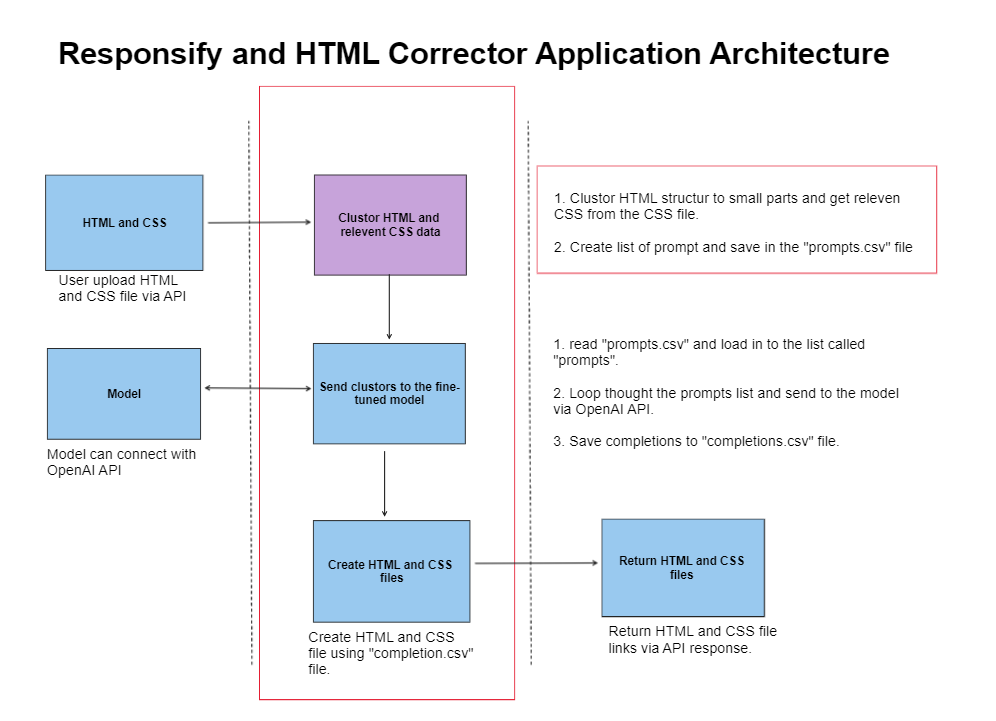

1. create a virtual environment using "python -m venv venv" command.

2. activate the Python environment by typing "./venv/Scripts/activate".

3. install required libraries using "pip install -r "./requierments.txt" command.

4. run the main application. type "python app.py" and run the flask server.

Use API "http://localhost:5000/upload" with the POST request. Add form data "CSS" and "HTML" as field names, and upload CSS and HTML files.

5. to use the ChatGPT model, add the “get_completion_langchain()” function in "app.py" line 37.

